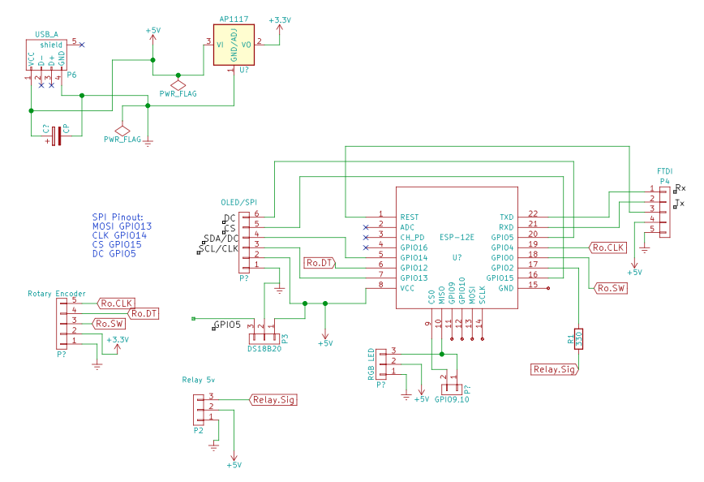
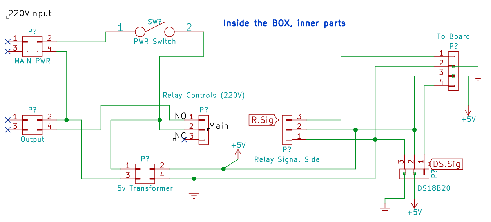

# ESP8266 Sousevide

## In progress
This is a menu driven and wifi driven Sousvide controller

The rotary used is  
http://www.ebay.com/itm/291347112498?_trksid=p2057872.m2749.l2649&var=590467326948&ssPageName=STRK%3AMEBIDX%3AIT

This is based on https://learn.adafruit.com/sous-vide-powered-by-arduino-the-sous-viduino?view=all

Pins used:

Screen:  
If il9341 (SPI) is used then: 
mosiPin 13  
clkPin 14 
csPin 15 
dcPin 5 

If SSD1306 is Used then: 
sclPin 13 
sdaPin 14

DS18B20 
dsTempPin 5

Relay Control: 
relayPin 2

Rotary Pins: 
encoderSwitchPin 0 //push button switch 
encoderCLK 4 
encoderDT 12 

Esp8266 Connections

Electrical box input/Output

